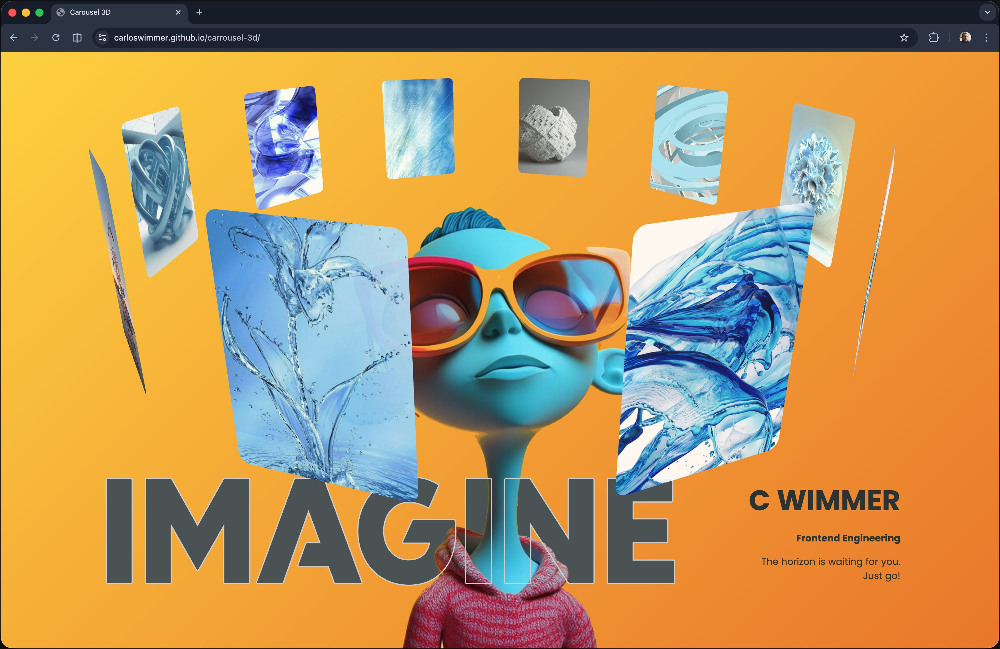

# Carousel 3D

A **pure HTML and CSS** experiment: a circular 3D image carousel with perspective, rotation, and layout polish — **No JavaScript** required.

[**View live on GitHub Pages →**](https://carloswimmer.github.io/carrousel-3d/)



<p align="center">
  <a href="https://carloswimmer.github.io/carrousel-3d/"></a>
  <a href="LICENSE"></a>
  <a href="https://developer.mozilla.org/docs/Web/HTML"></a>
  <a href="https://developer.mozilla.org/docs/Web/CSS"></a>
</p>

## Why this project

It is a focused study of how far you can push **3D transforms**, **custom properties**, and **layout** in the browser using only structural HTML and stylesheets—useful for understanding fundamentals before adding frameworks or scripts.

## Features

- **No JavaScript** — behavior comes from HTML structure and CSS only
- **3D carousel** — cards arranged on a circle with depth and perspective
- **Gallery link** — cards navigate to a secondary page (`gallery.html`)
- **Responsive-minded layout** — styled for a strong full-page presentation

## Run locally

Clone the repo and open `index.html` in a browser (double-click or use your OS file command).

```sh
git clone https://github.com/carloswimmer/carrousel-3d.git
cd carrousel-3d
```

**macOS**

```sh
open index.html
```

**Windows**

```sh
start index.html
```

**Linux (xdg-open)**

```sh
xdg-open index.html
```

## License

This project is released under the [MIT License](LICENSE).
